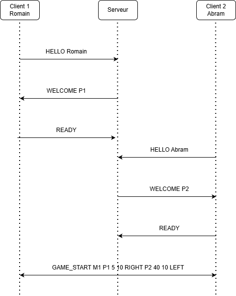
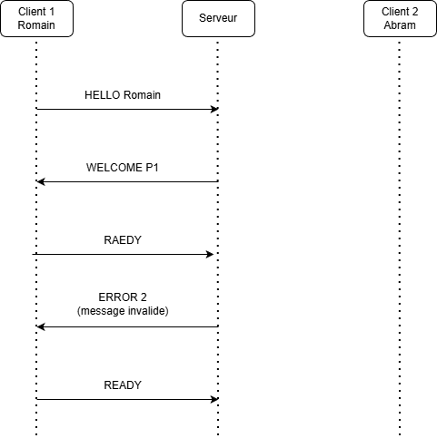

# Light-Tron-Cycle-2D

## Auteurs
- Romain Durussel 
- Abram Zweifel

HEIG-VD, Class C, 2025–2026

## Table des matières

- [Règles du jeu](#règles-du-jeu)
- [Le protocole applicatif](#le-protocole-applicatif)
    - [Aperçu](#aperçu)
    - [Protocole de transport](#protocole-de-transport)
    - [Messages](#messages)
        - [Connexion et annonce du joueur](#connexion-et-annonce-du-joueur-handshake-et-session)
        - [Déclaration de disponibilité (READY)](#déclaration-de-disponibilité)
        - [Début d’une partie (GAME_START)](#début-dune-partie)
        - [Envoi des entrées (INPUT)](#envoi-des-entrées)
        - [État du jeu (STATE)](#état-du-jeu)
        - [Fin de partie (GAME_END)](#fin-de-partie)
        - [Gestion des erreurs (ERROR)](#gestion-des-erreurs)
    - [Exemples](#exemples)
      - [Exemple fonctionnel - Connexion et début de partie](#exemple-fonctionnel---connexion-et-début-de-partie)
      - [Exemple non-fonctionnel - Commande inconnue](#exemple-non-fonctionnel---commande-inconnue)
- [Instructions de Build](#instructions-de-build)
- [Instructions d'Utilisation](#instructions-dutilisation)
    - [Lancer le Serveur](#lancer-le-serveur)
    - [Lancer le Client Graphique (GUI)](#lancer-le-client-graphique-gui)
    - [Lancer le Client Console (CLI)](#lancer-le-client-console-cli)
- [Docker & Déploiement](#docker--déploiement)
- [Utilisation d'Outils IA](#utilisation-doutils-ia)

## Règles du jeu

Le jeu s’inspire du concept du jeu multijoueur en 2D : Tron Light Cycle.

Deux joueurs se déplacent sur une grille dans l’une des quatre directions possibles : UP, DOWN, LEFT ou RIGHT. Chaque joueur laisse derrière lui une traînée qui occupe les cases du plateau au fur et à mesure de son déplacement.
Une partie se termine immédiatement lorsqu’un joueur entre en collision, que ce soit :

- avec un mur de la grille,

- avec sa propre traînée,

- avec la traînée de l’adversaire.

Le dernier joueur encore en vie est déclaré vainqueur.

En cas de collision simultanée (les deux joueurs arrivent sur la même case), la partie se conclut par un DOUBLE_KO, sans vainqueur.

## Le protocole applicatif
### Aperçu

Cette section définit un protocole d’application pour notre jeu multijoueur en ligne inspiré de Tron Light Cycle. 

Deux clients se connectent à un serveur autoritaire qui simule la partie sur une grille 2D. 
À chaque tick de la simulation, le serveur applique les entrées de direction, déplace les joueurs, met à jour les traînées, détecte les collisions. 
Une partie se termine lorsqu’un joueur entre en collision (avec un mur ou une traînée).

### Protocole de transport

Le protocole d’application est un protocole textuel utilisant TCP comme transport (fiable et orienté connexion).
Le port utilisé par défaut est 2222 (configurable via la CLI).

Les messages sont envoyés en texte brut UTF-8, un par ligne. Chaque message est donc une ligne terminée par \n.

Les messages ont la forme générale :

```
COMMANDE param1 param2 ... paramN
```

Le serveur peut à tout moment renvoyer un message pour signaler une erreur de protocole ou de logique. En cas d’erreur "grave", le serveur peut ensuite fermer la connexion.
Le serveur est autoritaire : seul son état fait foi.

Les clients envoient des entrées utilisateur et rendent l’état reçu.

### Messages

#### Connexion et annonce du joueur (handshake)

Le client annonce son nom du joueur au serveur. 
Le serveur répond en attribuant un identifiant unique au joueur dans la partie.

Requête :
```
HELLO <playerName>
```

- HELLO
  - playerName : pseudo du joueur, sans espace (par exemple Alex).

Réponses :
```
WELCOME <playerId>
ERROR <code> <message>
```

- WELCOME signifie que le serveur accepte la connexion et la version de protocole.
  - playerId : identifiant unique attribué au joueur (par exemple P1).

- ERROR signifie que le serveur refuse la connexion ou la version. 
  - code : entier représentant le type d’erreur (voir section [Gestion des erreurs](#gestion-des-erreurs)). 
  - message : court texte expliquant l’erreur.


#### Déclaration de disponibilité

Une fois connecté, le client informe le serveur qu’il est prêt à commencer une partie. 
Le serveur ne commencera une partie que lorsqu’il aura reçu un message READY de deux joueurs.

Requête :
```
READY
```

- Ce message ne contient pas de paramètre : il signifie simplement « je suis prêt ».

Réponses :

- Aucune réponse directe n’est envoyée.
- Lorsque les deux joueurs sont prêts, le serveur enverra un message GAME_START à tous les clients pour indiquer le début de la partie.


#### Début d’une partie

Le serveur informe les clients qu’une nouvelle partie commence. Il fournit les positions initiales et les directions des joueurs.

Requête :

- Aucun client n’envoie ce message. GAME_START est toujours envoyé par le serveur.

Réponses (diffusées par le serveur à tous les joueurs) :
```
GAME_START <matchId> <p1Id> <p1x> <p1y> <p1dir> <p2Id> <p2x> <p2y> <p2dir>
```

- matchId : identifiant de la partie.
- p1Id, p2Id : identifiants des joueurs (par exemple P1, P2).
- p1x p1y : position initiale du joueur 1
- p1dir : direction initiale du joueur 1 (UP, DOWN, LEFT ou RIGHT).
- p2x p2y : position initiale du joueur 2.
- p2dir : direction initiale du joueur 2.

Les traînées sont vides au début de chaque partie ; seuls les deux points de départ des joueurs sont occupés.


#### Envoi des entrées

Le client envoie au serveur la direction que le joueur souhaite prendre.
Le serveur applique au plus une direction par joueur et par tick, en utilisant la dernière direction reçue à temps.

Requête :
```
INPUT <direction>
```

- direction : une des valeurs suivantes : UP, DOWN, LEFT, RIGHT.

Le client peut envoyer plusieurs INPUT très rapprochés ; le serveur choisira la dernière direction reçue avant le prochain tick.

Réponses :

- Il n’y a pas de réponse immédiate à un message INPUT.
- L’effet d’un INPUT est visible dans les messages STATE ultérieurs envoyés par le serveur : la position et la direction du joueur seront mises à jour.


#### État du jeu

Le serveur envoie régulièrement un résumé de l’état actuel de la partie à tous les clients. 
Ce message contient le numéro de tick, une description simplifiée des positions des joueurs et des traînées.

Pour garder le protocole lisible, les informations complexes (positions des traînées) sont envoyées dans une forme compacte (listes séparées par des virgules).

Requête :

- Les clients n’envoient jamais de message STATE. Ce message est toujours émis par le serveur.

Réponses (diffusées par le serveur à tous les joueurs) :
```
STATE <matchId> <tick> <phase> <players> <trailsP1> <trailsP2>
```

- matchId : identifiant de la partie.
- tick : numéro du tick dans la partie (débute à 0 au début de chaque partie).
- phase : phase actuelle du jeu. Les valeurs possibles sont :
  - LOBBY : la partie n’a pas encore commencé (en attente des joueurs prêts). 
  - RUNNING : la partie est en cours. 
  - GAME_OVER : la partie est terminée (un message GAME_END a été ou va être envoyé).
- players : liste des joueurs, au format : playerId:x:y:dir:alive,playerId2:x2:y2:dir2:alive2 
- trailsP1 : liste des coordonnées occupées par la traînée du Joueur 1 (format x:y,x:y... ).
- trailsP2 : liste des coordonnées occupées par la traînée du Joueur 2.

#### Fin de partie

Lorsqu'un joueur entre en collision, le serveur annonce la fin de la partie et le gagnant final.

Requête :

- Les clients n’envoient pas ce message. GAME_END est exclusivement envoyé par le serveur.

Réponses (diffusées par le serveur à tous les joueurs) :
```
GAME_END <reason> <winnerId>
```
- reason : raison de la fin de partie. Les valeurs possibles sont :
  - COLLISION : un joueur est entré en collision avec un mur ou une traînée. 
  - DOUBLE_KO : les deux joueurs entrent en collision en même temps, par exemple en arrivant sur la même case ou en se percutant tête-à-tête. 
  - DISCONNECT : un joueur s’est déconnecté pendant la partie.
- winnerId : identifiant du joueur qui a gagné la partie. En cas de DOUBLE_KO (égalité), cela doit être '-'.

Après ce message, le serveur peut attendre de nouveaux READY pour démarrer une nouvelle partie.


#### Gestion des erreurs

Le serveur utilise ce message pour signaler un problème de protocole, un message invalide ou une action non autorisée. 
En fonction de la gravité de l’erreur, le serveur peut continuer à accepter des messages ou fermer la connexion.

Requête :

- Les clients n’envoient pas ERROR. Ce message est uniquement envoyé par le serveur.

Réponse (du serveur vers le client) :
```
ERROR <code> <message>
```

- code : entier indiquant le type d’erreur.
- message : court texte explicatif.

Les codes d’erreur suivants sont définis :

- 1 : version non supportée.
- 2 : message invalide (syntaxe incorrecte ou paramètre manquant).
- 3 : action non autorisée (par exemple INPUT envoyé alors qu’aucune partie n’est en cours).
- 4 : partie pleine (le serveur ne peut pas accepter un nouveau joueur).
- 5 : erreur interne du serveur.

### Exemples

#### Exemple fonctionnel - Connexion et début de partie

On suppose le scénario suivant :

- Client 1 : Romain
- Client 2 : Abram
- Identifiants uniques attribués par le serveur : P1 et P2
- Identifiant unique de partie : M1



Une fois les deux joueurs connectés et prêts, le serveur envoie GAME_START à chacun. À ce stade :

- ils connaissent tous les deux leur playerId (P1 et P2) grâce à WELCOME,
- ils connaissent tous les deux leurs positions et directions initiales grâce à GAME_START,
- la partie M1 passe en phase RUNNING.

#### Exemple non-fonctionnel - Commande inconnue

On suppose le scénario suivant :

Le client Romain se connecte au serveur, mais envoie une commande invalide "RAEDY" à la place de "READY".



Le serveur détecte la syntaxe incorrecte et va répondre en conséquence avec le message :
```bash
ERROR 2 message invalide
```

Le client pourra alors corriger son erreur et renvoyer le message correct.

---

## Instructions de Build

Le projet inclut un **Maven Wrapper**, ce qui signifie que vous n'avez pas besoin d'installer Maven manuellement.
Seul le JDK 21 est requis.

### 1. Cloner le projet :
```bash
git clone [https://github.com/Abram0303/Light-Tron-Cycle-2D.git](https://github.com/Abram0303/Light-Tron-Cycle-2D.git)
cd Light_Tron_Cycle_2D
 ```

### 2. Compiler et construire le JAR :

Sous Linux / macOS / WSL :

```Bash
./mvnw clean package
Sous Windows (CMD / PowerShell) :
```

```Bash
./mvnw.cmd clean package
```

Une fois la compilation terminée, le fichier exécutable ("Fat JAR") se trouve ici : `target/Light_Tron_Cycle_2D-1.0-SNAPSHOT.jar`

---

## Instructions d'Utilisation

L'application utilise des sous-commandes pour lancer les différents modes.

### Lancer le Serveur

Démarre le serveur sur le port 2222.

```bash
java -jar target/Light_Tron_Cycle_2D-1.0-SNAPSHOT.jar server
```

*Options :*

* `-p <port>` : Changer le port d'écoute.
* `-t <millis>` : Changer la durée d'un tick (vitesse du jeu).

### Lancer le Client Graphique (GUI)

Lance l'interface JavaFX. C'est le mode recommandé pour jouer.

```bash
java -jar target/Light_Tron_Cycle_2D-1.0-SNAPSHOT.jar gui
```

Une fois lancé, cliquez sur **START** pour vous signaler comme "READY". Utilisez les flèches directionnelles, ZQSD ou AWSD pour vous déplacer.

### Lancer le Client Console (CLI)

Lance le mode textuel interactif (REPL). Utile notamment pour le débogage.

```bash
java -jar target/Light_Tron_Cycle_2D-1.0-SNAPSHOT.jar client -n playerName
```

*Commandes disponibles dans le REPL :* `ready`, `up`, `down`, `left`, `right`, `help`, `quit`.

---

## Docker & Déploiement

Le projet est conçu pour être distribué via **GitHub Container Registry (GHCR)**.

### 1. Pour les utilisateurs (Lancer le serveur)

N'importe quel utilisateur peut lancer le serveur immédiatement avec Docker, sans avoir besoin d'installer Java, Maven ou de cloner le code source.

**Commande unique pour lancer le serveur sur le port 2222 (port par défaut) :**
```bash
docker run -i -p 2222:2222 ghcr.io/abram0303/light-tron-cycle-2d:latest
````

* `-i` : Garde le processus interactif (permet de voir les logs et d'arrêter avec Ctrl+C).
* `-p 2222:2222` : Ouvre le port 2222 pour que les clients puissent se connecter.
* *Note : Si l'image est privée, vous devrez d'abord vous authentifier via `docker login ghcr.io`.*

-----

### 2. Pour les développeurs (Publier une nouvelle version)

Si vous modifiez le code source du serveur, voici comment mettre à jour l'image Docker disponible en ligne.

**Étape 1 : Construction de l'image (Build)**

```bash
# Assurez-vous d'être à la racine du projet
docker build -t ghcr.io/abram0303/light-tron-cycle-2d:latest .
```

**Étape 2 : Publication (Push)**

```bash
docker push ghcr.io/abram0303/light-tron-cycle-2d:latest
```

-----

### Alternative locale (Docker Compose)

Pour le développement local, vous pouvez aussi utiliser Docker Compose pour construire et lancer en une seule étape :

```bash
docker compose up --build
```

---

## Utilisation d'Outils IA

ChatGPT a été utilisé comme outil de support pour :

* La génération de la structure initiale du code JavaFX; principalement dans le code pour générer la map.
* L'optimisation du Dockerfile (Multi-stage build); quelle image utiliser, etc.
* La rédaction et la correction de la documentation technique.
* Le débogage des problèmes de concurrence (Synchronized Lists et l'affichage des traces des différentes motos).

L'intégralité du code final a été revue, intégrée et validée manuellement par les auteurs.